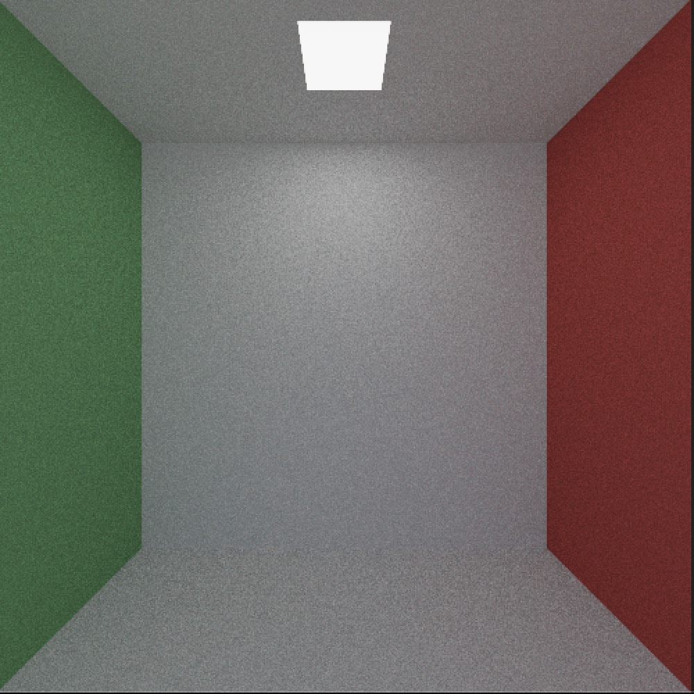
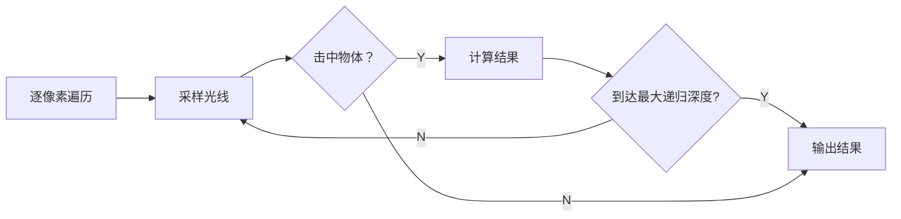

# Soft Ray Tracing 

> 项目进行中，进度约50%

## 0. What

这是一个基于 C++ 实现的 CPU 端渲染的光线追踪算法，旨在复现光线追踪算法中的重要核心内容，最终输出的测试场景为 Cornell box

本项目包含以下实现要点

- 光线与几何形体的求交
  - OBJ文件读取的物体（Triangle Mesh）（TODO）
  - 隐式几何（Implicit Surface）表示定义的圆与立方体
- 朴素蒙特卡洛近似的MSAA抗锯齿
- 基于SAH实现的BVH加速结构
- 使用蒙特卡洛估计实现的渲染方程近似
- 多重重要性混合的重要性采样（MIS）
  - 余弦加权采样（Cosine-weighted Sampling）
  - 基于 NDF 的采样的微表面模型（TODO）
  - 光源采样（Light Sampling）
- 基于历史帧与引导滤波（Guided Filter）实现的降噪

## 1. How

项目主要参考 Ray Tracing 三部曲进行实现，沿用其渲染框架与实现结构，项目核心是对光线追踪算法的实现，流程参考如下

## 2. Reference

[Ray Tracing in One Weekend — The Book Series](https://raytracing.github.io)

[GAMES101](https://www.bilibili.com/video/BV1X7411F744?spm_id_from=333.788.videopod.episodes&vd_source=35656623bbb678de699bcd2742ccb713)

